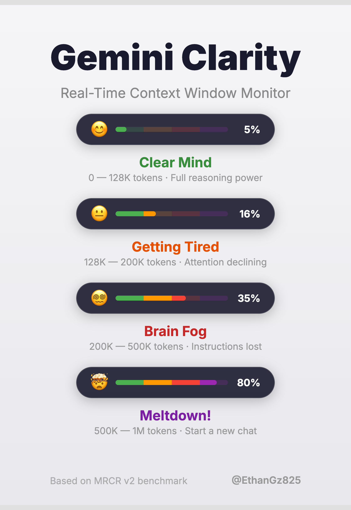
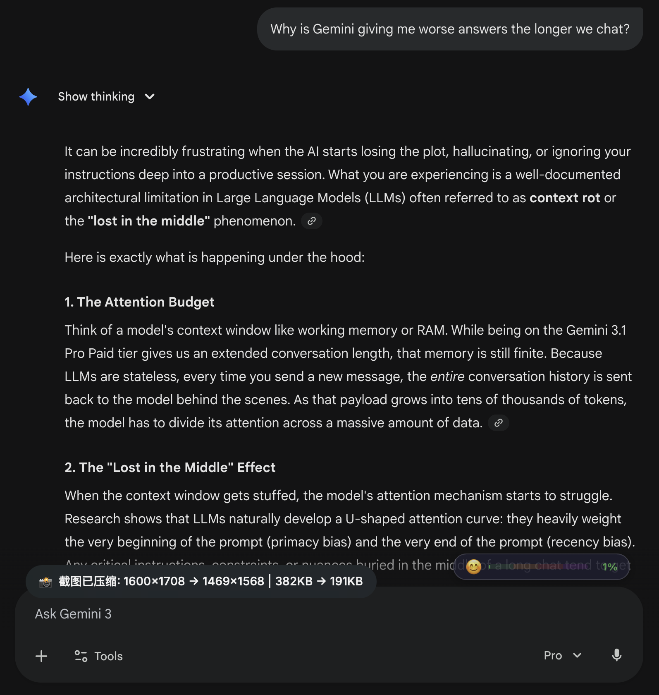

<p align="center">
  
</p>

<h1 align="center">Gemini Clarity</h1>

<p align="center">
  Real-time context window monitor for <a href="https://gemini.google.com/">Gemini</a>. Know when your conversation starts losing clarity.
</p>

<p align="center">
  <a href="./README_CN.md"><strong>中文文档</strong></a>
</p>

---

<p align="center">
  
</p>

## Why

Gemini's 1M token context window degrades long before hitting the limit — accuracy drops after ~128K tokens, but the UI tells you nothing. This extension makes the invisible visible.

## Features

- **Floating pill widget** on the Gemini page — emoji + progress bar + percentage
- **Smart token counting** — local estimation out of the box, optional API for precision
- **Four clarity levels** with color-coded status:

| Level | Range | Meaning |
|-------|-------|---------|
| 😊 Clear | 0-128K | High-efficiency zone |
| 😐 Tired | 128K-200K | Accuracy dropping |
| 😵‍💫 Foggy | 200K-500K | Quality degraded, double-check everything |
| 🤯 Meltdown | 500K-1M | Start a fresh conversation |

- **Smart compensation** for hidden tokens (thinking mode, code blocks, system prompts, images)
- **Dynamic toolbar icon** — color changes with status at a glance
- **Zero data collection** — pure client-side

## Good to Know

- **It's an estimate, not exact.** Token counting can't be 100% precise from the outside, but it works well as an "AI fatigue early-warning system". When the status turns Tired or goes red — time to start a new chat.
- **Long conversations may show lower usage initially.** Gemini lazy-loads older messages — only recent turns are in the DOM when you open a conversation. Scroll up to load the full history for an accurate reading.
- **The clarity thresholds are based on Gemini 2.5 Pro benchmarks.** The "200K performance cliff" comes from 2.5 Pro testing data. Newer models (3.0+) have better long-context retention, so real-world performance may be better than shown. That said, the "lost-in-the-middle" attention pattern is a fundamental property of all transformers — keep an eye on context length for complex tasks.

## Install

### Chrome / Edge / Chromium

1. Clone or download this repo
2. Go to `chrome://extensions/` → Enable Developer mode → Load unpacked → Select this folder
3. Open Gemini and start chatting — **works immediately, no setup required**

### Firefox

1. Clone or download this repo
2. Go to `about:debugging#/runtime/this-firefox` → Click **Load Temporary Add-on…** → Select the `manifest.json` file inside this folder
3. Open Gemini and start chatting — **works immediately, no setup required**

> **Note:** Temporary add-ons in Firefox are removed when the browser restarts. To install permanently, the extension must be signed via [Firefox Add-on Developer Hub](https://addons.mozilla.org/en-US/developers/) or by enabling unsigned extension support (`xpinstall.signatures.required = false` in `about:config`, available only in Firefox Developer Edition / Nightly / ESR).

### Optional: Enable Precise Mode

By default, the extension uses local character-based estimation (~80% accuracy, good enough for trend monitoring). For token-level precision:

1. Get a free [Gemini API Key](https://aistudio.google.com/app/apikey) (takes 30 seconds)
2. Click the extension icon → Settings → Paste your key → Save
3. The extension will now use Google's official `countTokens` API — the exact same tokenizer Gemini uses internally

> **Privacy & Security:** Your API key is stored locally in the browser's extension storage and never leaves your browser. The extension has no backend server — all processing happens client-side. The `countTokens` API is completely free (no quota consumed, no cost). If you prefer not to provide an API key, the extension works just fine with local estimation.

## File Structure

```
src/
├── tokenizer.js    # Token counting (API + fallback)
├── content.js      # In-page widget & DOM observer
├── background.js   # API proxy & dynamic icon
├── popup.html/js   # Popup panel
```

## License

MIT
